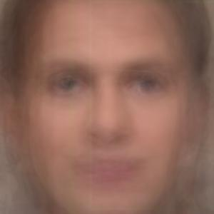

# **Python Samples**

## Listed are the python programs along with a brief overview of what they're supposed to do:

### **Image to Array**

> This program is a small demo that shows how the library `Pillow` can convert images to arrays and then save them. It is dependent on `pip3 install --user Pillow`

```
python3 image-to-array.py
```
[Converting to 1D array](https://stackoverflow.com/questions/15612373/convert-image-png-to-matrix-and-then-to-1d-array)

[Keeping Aspect Ratio the same](https://stackoverflow.com/questions/273946/how-do-i-resize-an-image-using-pil-and-maintain-its-aspect-ratio)

[Resizing using Pillow](https://www.geeksforgeeks.org/python-pil-image-resize-method/)

[Pillow Documentation](https://pillow.readthedocs.io/en/stable/reference/Image.html)

[Importing image to array](https://www.pluralsight.com/guides/importing-image-data-into-numpy-arrays)

### **Scan a set of images for Faces**

> This program uses a Haar cascade detector I found on GitHub [here](https://github.com/shantnu/FaceDetect). It will take an image as input and then draw a square around it. I wrote a small script that will loop over all of the files in the `img/faces` folder and show you how it works. Purely a demo at this point.

[GitHub source](https://github.com/rcrespocano/opencv-python/issues/2)

[Fixed the repo code](https://answers.opencv.org/question/216137/attributeerror-module-cv2cv2-has-no-attribute-saliencysolved/)

[OpenCV info](https://docs.opencv.org/2.4/modules/highgui/doc/user_interface.html)

[OpenCV tutorial](https://opencv-python-tutroals.readthedocs.io/en/latest/py_tutorials/py_gui/py_image_display/py_image_display.html)

> In order to see it run, execute the following command in your terminal (make sure it's executable in your shell):
```
./scan-faces.sc
```

We'll need something similar in operation to the above script that will take a video slice (an image), captures a face in it and then save that face as a separate image. There are a couple of interesting cases in the current set of face images wherein there are multiple faces found when there is only one per image.

### **Scale Image Set**

> Ultimately, in order to create the set of Eigenfaces, we'll have to ensure that all of the images are of the same size. Hence, the following script takes the set of faces that were scraped from the image set and scales them to the same size, saving them in the folder `img/faces/scaled-faces/`

```
python3 scale-image-set.py
```

From here, all of the faces are equal in dimension and we can start to make a first attempt at a set of Eigenfaces.

Update: this script will now create the average faces from all of the faces that were scraped from the image set; ~~at this point, it doesn't save it anywhere - only for display.~~

Now, the script will save the 'average' face to a new folder `img/faces/average-face`; it's calculated from all of the scaled-faces:



### **Calculate the difference of each face from the average face**

Before constructing the matrix of 'average' differences, each difference must be calculated.

```
python3 make-average-faces.py
```

This script saves all the *differences from the average* of each of the faces. One difference here, from the example given in the textbook, is these are color images (instead of the grayscale shown in the book). This is the raw data from which we can begin to create the covariance matrix, C.

### **Create a covariance matrix of images**

The first task is to simply construct a covariance matrix of faces from the average-difference images.

```
python3 make-image-matrix.py
```

